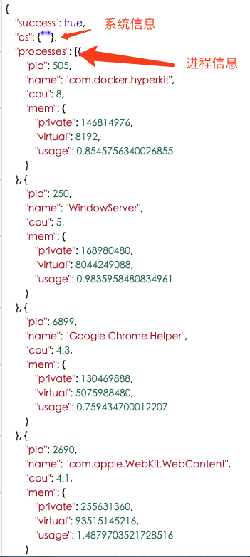

## 总结
### 预览地址
[http://39.98.252.43:8888/device](http://39.98.252.43:8888/device)

### 遇到问题
> 参考了同学的进程杀死重启的代码
+ 怎么获取命令端执行命令显示的结果？
  + 使用child_process中的exec方法可以拿到执行结果
+ 怎么监听到文件变化？
  + 使用fs.watch来监听文件变动
  + 文件变动就重启服务
+ 怎么重启进程？
  + 直接重启出现该端口被占用的问题
  + 重启之前，先杀死之前的node进程，杀死之前node进程的方法使用spawn创建实例的kill('SIGKILL')
+ nodejs服务器部署，www目录怎么处理？
  + www目录部署到mnt下面 
+ 本地代码如何同步到服务器问题？
  + 使用 rsync -vzrtopg --progress 增量同步到服务器上
+ ecs服务器部署好，启动服务，本地无法通过ip访问？
  + 设置nodejs，127.0.0.1改为通配ip0.0.0.0
  + 阿里云安全组打开端口

### 结果
